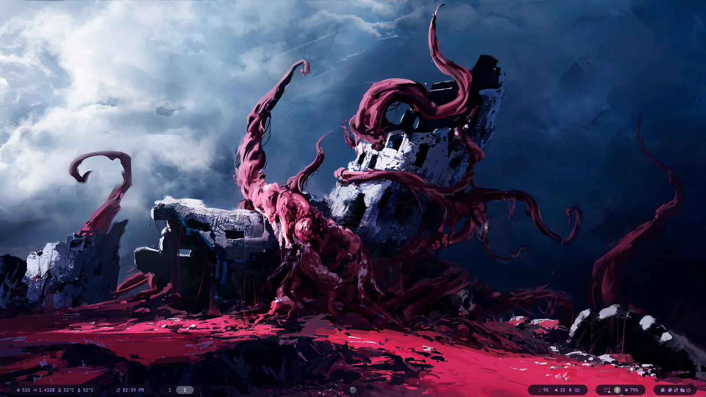
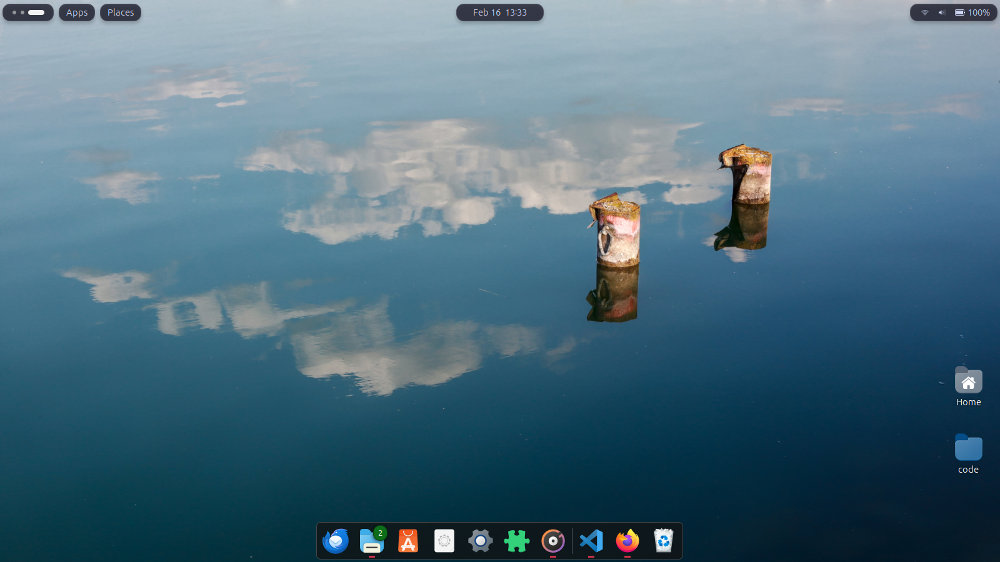

# 🐧 HyprGnome

<p align="center">
  
  
  
</p>

A collection of my personal configurations for a hybrid workflow on Arch Linux blending the elegance of **Hyprland**.

## 📸 Showcase

### Hyprland (The Tiling Speedster)


### GNOME (The Polished Daily Driver)


## 🖥️ System Specs
| Component | Choice |
| :--- | :--- |
| **OS** | [Arch Linux](https://archlinux.org) |
| **WM** | [Hyprland](https://hyprland.org) |
| **Terminal** | Kitty / Ghostty |
| **Shell** | Zsh (with Oh My Zsh) |
| **Bar** | Waybar |
| **Launcher** | Rofi / Wofi |

## 🚀 Installation

> [!WARNING]
> Always back up your existing configurations before applying new ones!

I use **GNU Stow** to manage these dotfiles.

1. **Clone the repo:**
   ```bash
   git clone https://github.com ~/dotfiles
   cd ~/dotfiles
       
2. **Keybindings (Hyprland):**
    Super + Q : Open Terminal
    Super + C : Kill Active window
    Super + M : Exit Hyprland
    Super + E : Open File Manager

## Icons
    Copy/Download the icons directory and rename it to ".icons" in 
    your gnome home directory to activate the icons and cursors in 
    the directory
    
    **Note**: Download gnome-tweaks and gnome extension to enable 
    the icons and cursors
    
## Themes
    My Themes for gnome destop environment are located in the topbar@gnome.
    Use the same steps for the icons, copy/download the directory and rename
    it to ".themes"


